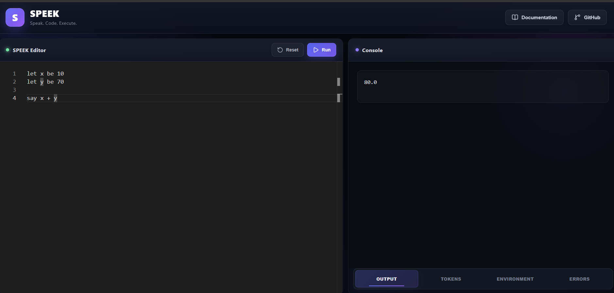

# SPEEK — Custom Programming Language & Web IDE

SPEEK is a custom programming language and interpreter built from scratch in **Java**, along with a browser-based IDE for writing, executing, and inspecting SPEEK programs.

The project demonstrates the complete interpreter pipeline:

**Source Code → Tokenization → Parsing → Evaluation → Output**

The interpreter is connected to a **React-based web IDE** through a **Spring Boot REST API**, making SPEEK executable directly from the browser.

## 📸 Web IDE



## ✨ Features

### SPEEK Language

- Variable declaration and assignment
- Arithmetic expressions
- String values
- Variable references
- Output statements
- Conditional statements
- Repeat/loop statements
- Expression evaluation

### Interpreter

- Custom tokenizer
- Parser for SPEEK syntax
- Instruction-based evaluation
- Runtime environment for variables
- Error handling
- Token generation and inspection

### Web IDE

- Monaco code editor
- Execute SPEEK programs directly in the browser
- Output console
- Token viewer
- Environment/variable viewer
- Error panel
- Reset functionality
- Built-in documentation

## 🧠 Interpreter Architecture

```text
              SPEEK Source Code
                      │
                      ▼
                ┌───────────┐
                │ Tokenizer │
                └─────┬─────┘
                      │
                      ▼
                   Tokens
                      │
                      ▼
                ┌───────────┐
                │   Parser  │
                └─────┬─────┘
                      │
                      ▼
                 Instructions
                      │
                      ▼
                ┌───────────┐
                │ Evaluator │
                └─────┬─────┘
                      │
                      ▼
                    Output